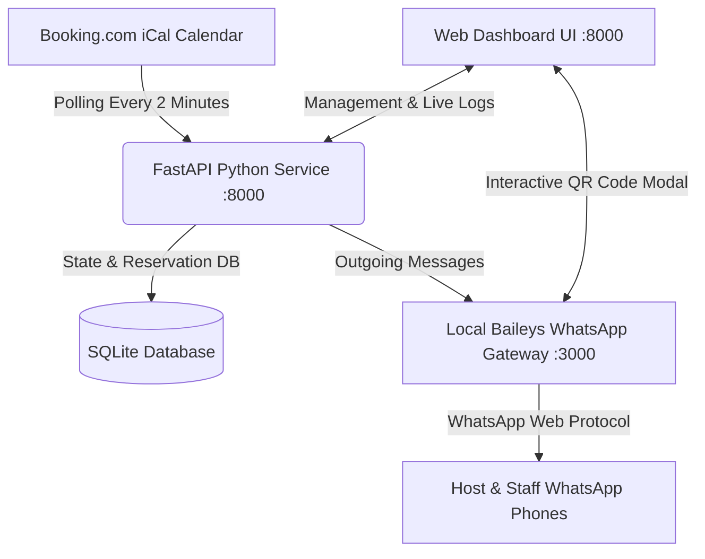
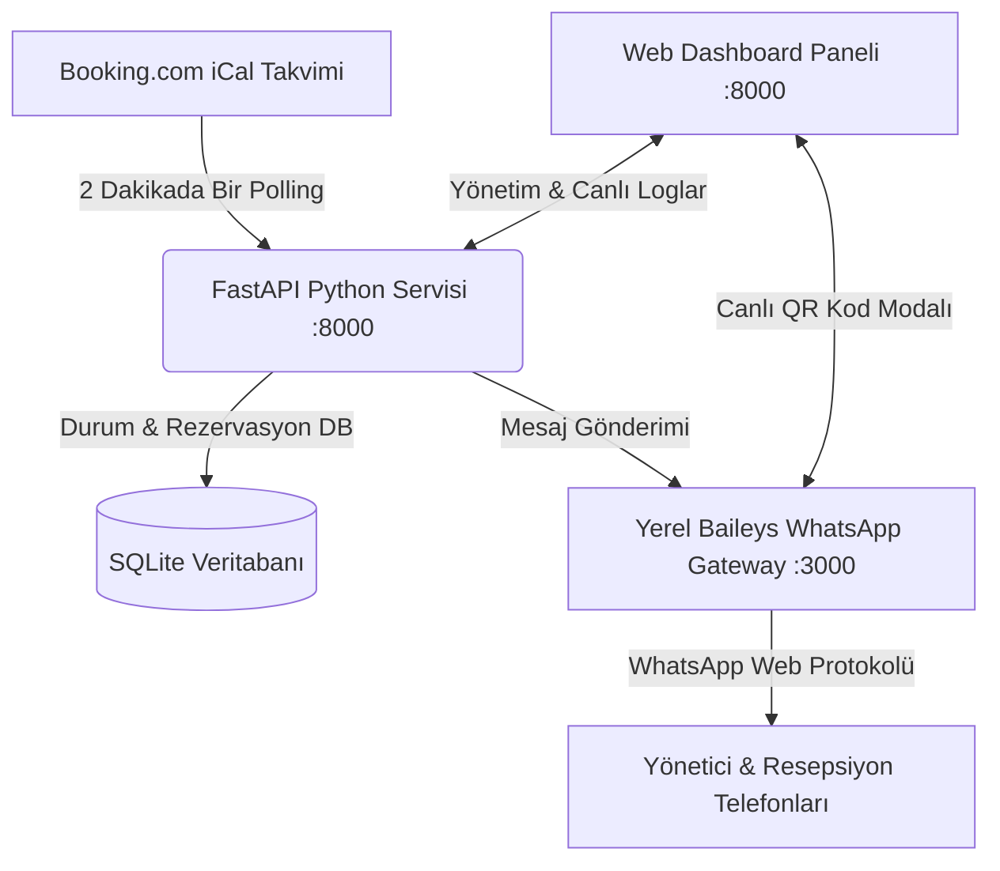

# 🏨 Booking.com WhatsApp & Legal Compliance (KBS) Automation Bot (Self-Hosted)

> 🌐 **Language / Dil:** [🇬🇧 English](#-english) | [🇹🇷 Türkçe](#-türkçe)  
> *English documentation is at the top. Türkçe açıklamalar sayfanın alt kısmında yer almaktadır.*

---

# 🇬🇧 English

A 100% **self-hosted**, lightweight, and automated bot designed for hotels, apartments, boutique villas, and short-term rentals. It monitors your **Booking.com** reservations 24/7 via iCal, notifies you instantly on WhatsApp for new bookings, and sends morning Check-in / Check-out reminders with legal police/identity reporting compliance notices (**Turkish KBS / Police Notification System**).

Includes a built-in **100% Free Self-Hosted WhatsApp Web Gateway (Baileys)**: no paid third-party APIs, no trial expirations, and zero monthly subscriptions!


---

## 🖥️ Dashboard Overview (What's on the Panel?)

The web dashboard (`http://<SERVER-IP>:8000`) provides real-time control and visibility over your property:

1. **Top Header & Control Bar:**
   - **Property Title:** Identifies the active suite and server status.
   - **WhatsApp Gateway Badge:** Shows live connection status (`🟢 WhatsApp: Connected`). Clicking it opens the interactive QR pairing modal to link any WhatsApp number within seconds.
   - **"Sync Now" (`Şimdi Eşle`):** Manually triggers an immediate Booking.com iCal calendar sync and processes today's check-in/out alerts.
   - **"Booking Alert Test" (`Rezervasyon Bildirimi Testi` - Violet Button):** Instantly re-dispatches the newest booking notification to all registered WhatsApp numbers.
   - **"Send Test" (`Test Gönder` - Green Button):** Dispatches a quick system test alert to verify gateway communication.

2. **Today's Status Cards:**
   - **🔴 Today's Check-outs:** Highlights rooms departing today, check-out times, and housekeeping readiness badges.
   - **🟢 Today's Check-ins:** Highlights incoming guests, arrival dates, and key handover/police identity registration badges.

3. **Active Reservations Table:**
   - Displays the last 50 reservations with real-time status badges (*Staying*, *Check-in Today*, *Check-out Today*, *Checked Out*, *Upcoming*).
   - **Guest Welcome Dispatcher (`Karşıla`):** Input the guest's phone number to send a personalized bilingual (EN/TR) welcome message with Wi-Fi credentials, Google Maps location, and check-in times.
   - **Re-Notify Button (`[🔔 Bildir]`):** Resends the new reservation WhatsApp alert for that specific booking anytime.

4. **Live System Event Log (Console):**
   - Displays real-time, timestamped operational logs (calendar poll results, WhatsApp delivery status, error traces) directly in the UI.

5. **Settings & Custom Message Templates Form:**
   - Configure suite name, destination WhatsApp numbers (multiple numbers or group IDs), morning reminder dispatch hour (`09:00`), and dynamic message templates using `{suite_name}`, `{checkin}`, `{checkout}` variables.

## 🌟 Key Features

- 🆓 **100% Free Self-Hosted WhatsApp Gateway:** Powered by Baileys & Node.js running directly on your server. Pair your phone once via QR code directly in the web UI. No paid subscriptions, no per-message fees!
- 🛎 **Instant Booking Alerts:** Automatically polls the Booking.com iCal feed every 2 minutes. When a new reservation arrives, it sends an immediate WhatsApp notification to the host, reception, or staff group.
- 🚨 **Legal Compliance & Police (KBS) Reminders:** 
  - Morning Check-in alert (`09:00` by default): Reminds staff of key handover and mandatory police guest registration.
  - Morning Check-out alert: Reminds staff to start housekeeping and file the police check-out notification.
- 🛡️ **Fail-Safe & Self-Healing Reminder Scheduler:** Evaluates pending daily reminders against database state (`>= morning_time`). Even if the container reboots or the 2-minute polling interval drifts past 09:00, morning check-in/out messages are guaranteed to dispatch without being skipped!
- 🔑 **Guest Welcome & Self Check-in Dispatcher:**
  - One-click personalized bilingual (English & Turkish) WhatsApp message to incoming guests containing Wi-Fi credentials, check-in (`15:00`) / check-out (`11:00`) hours, and Google Maps pin.
- 🌐 **Modern & Responsive Web Dashboard:** Accessible at `http://<IP>:8000`, built with Tailwind CSS, showing today's arrivals, departures, live logs, active reservations, and an interactive WhatsApp QR pairing modal.
- 🕒 **Smart Status Transition:** On check-out day, the reservation badge shows *"Check-out Today"* before 11:00 AM, and automatically turns into *"Checked Out"* after standard check-out time (11:00 AM).
- 📱 **Multi-Number & WhatsApp Group Support:** Delivers alerts to multiple comma-separated phone numbers (`+905...,+905...`) or directly to a shared WhatsApp staff group.
- ✏️ **Customizable Message Templates:** Edit WhatsApp notification templates (`{suite_name}`, `{checkin}`, `{checkout}`) directly from the web dashboard with a single click.
- 💾 **Persistent SQLite Database:** Retains state across server reboots, ensuring no duplicate messages are ever sent.
- 🚀 **Zero Cloud Subscription Fees:** Runs entirely on your own local server (Proxmox LXC, Raspberry Pi, or Linux VPS) with no monthly quotas (unlike Make.com or Zapier).

---

## 🏗️ Architecture Diagram



---

## 🚀 Quick Start & Installation

### Step 1: Create a Proxmox LXC Container (1 Minute)
From your Proxmox web interface (`https://<proxmox-ip>:8006`), click **"Create CT"**:
- **Hostname:** `booking-bot`
- **Template:** `Debian 12` or `Debian 13` (or `Ubuntu 22.04 / 24.04`)
- **Disk:** `4 GB` or `8 GB`
- **CPU:** `1 Core`
- **RAM:** `512 MB` *(The bot and gateway combined consume only ~120 MB of RAM)*
- **Network:** `DHCP` (or static local IP)

Start the container and open the **">_ Console"** tab.

---

### Step 2: Install Packages & Clone the Repository
Inside the container console, run:

```bash
# Update and install required packages
apt update -y && apt install -y git python3 python3-pip python3-venv nodejs npm

# Clone this repository and enter the directory
git clone https://github.com/MrCoolice/booking-whatsapp-bot.git /opt/dalaman-suite-bot
cd /opt/dalaman-suite-bot
```

---

### Step 3: Run the 1-Click Installer Script

```bash
chmod +x install.sh
./install.sh
```

The script automatically:
- Creates an isolated Python virtual environment (`venv`),
- Installs Python dependencies (`fastapi`, `uvicorn`, `apscheduler`, `requests`, `jinja2`, etc.),
- Installs WhatsApp Gateway Node.js dependencies (`@whiskeysockets/baileys`, `express`, `qrcode`),
- Configures and starts both systemd services (`dalaman-bot` on `:8000` and `dalaman-gateway` on `:3000`) to run 24/7 in the background.

---

### Step 4: Open Web Dashboard & Link Your WhatsApp

1. Open your browser and navigate to:  
   👉 **`http://<CONTAINER-IP>:8000`**
2. In the top right header, click the **"WhatsApp"** status button (it will show *QR Bekleniyor* or *Kontrol Ediliyor*).
3. A popup will display the WhatsApp pairing QR code.
4. On your phone, open WhatsApp:  
   👉 **Settings > Linked Devices > Link a Device** and scan the QR code on your screen.
5. The badge will instantly turn green: **"🟢 WhatsApp: Aktif (+90...)"**.

*(Alternatively, you can view the QR code directly at `http://<CONTAINER-IP>:3000/qr-view`).*

---

### Step 5: Configure Booking.com iCal Link

In the **System Settings** section on the right side of the dashboard:
1. Enter your **Property / Suite Name**
2. Enter your **WhatsApp Phone Number(s)** (e.g., `+90542XXXXXXX`)
3. Paste your **Booking.com iCal Link** (.ics)
4. Click **"Save All Settings & Templates"**.

---

## 🔑 How to Get Your Booking.com iCal Export Link

1. Log in to [Booking.com Extranet](https://admin.booking.com).
2. Go to **Rates & Availability > Sync Calendars**.
3. Under the desired room/suite, click **"Export Calendar"**.
4. Copy the provided `.ics` URL (e.g., `https://ical.booking.com/v1/export?t=...`).
5. Paste this URL into the **"Booking iCal Link"** field in the bot's web dashboard.

---

## ⚙️ Service Management

Both services are managed seamlessly via `systemd`:

```bash
# Python Bot (Port 8000)
systemctl status dalaman-bot
systemctl restart dalaman-bot
journalctl -u dalaman-bot -f

# WhatsApp Gateway (Port 3000)
systemctl status dalaman-gateway
systemctl restart dalaman-gateway
journalctl -u dalaman-gateway -f
```

---

<br><br>

---

# 🇹🇷 Türkçe

Otel, apart, villa ve butik konaklama tesisleri için geliştirilmiş; **Booking.com** rezervasyonlarını 7/24 izleyen, yeni rezervasyonları ve günlük Check-in / Check-out hatırlatmalarını yasal **KBS / Polis Kimlik Bildirimi uyarısıyla** birlikte WhatsApp üzerinden ileten, **%100 yerel (self-hosted)** otomasyon platformu.

Sistem, bünyesinde barındırdığı **%100 Ücretsiz Yerel WhatsApp Gateway (Baileys)** sayesinde üçüncü parti ücretli API'lere (UltraMsg, Twilio vb.) aylık abonelik ödemenize gerek kalmadan tamamen kendi sunucunuz üzerinden çalışır!


---

## 🖥️ Web Yönetim Paneli İncelemesi (Panelde Neler Var?)

Tarayıcınızdan `http://<SUNUCU-IP>:8000` adresine girdiğinizde sizi karşılayan modern arayüz ve bileşenler:

1. **Üst Kontrol & Durum Çubuğu:**
   - **Tesis Başlığı & Canlı Tarih:** Tesis adı ve güncel sistem tarihini gösterir.
   - **WhatsApp Bağlantı Rozeti:** Durumu canlı gösterir (`🟢 WhatsApp: Bağlı (Aktif)`). Tıklandığında telefonla hemen okutabileceğiniz **canlı QR kod eşleme penceresini** açar.
   - **"Şimdi Eşle" Butonu (Mavi):** Booking takvimini hemen indirir ve bugünkü giriş/çıkış kontrollerini anında çalıştırır.
   - **"Rezervasyon Bildirimi Testi" (Mor Buton):** En son gelen rezervasyonu alıp WhatsApp numaralarınıza *"🛎 YENİ BOOKING REZERVASYONU DÜŞTÜ!"* bildirimini manuel olarak anında tekrar gönderir.
   - **"Test Gönder" Butonu (Yeşil):** WhatsApp ağ geçidinin ve numaralarınızın çalıştığını doğrulamak için genel bir test mesajı iletir.

2. **Günün Durum Kartları:**
   - **🔴 Bugün Çıkış (Check-out) Yapacaklar:** O gün tesisten ayrılacak odaları, çıkış saatini ve temizlik hazırlık rozetini gösterir.
   - **🟢 Bugün Giriş (Check-in) Yapacaklar:** O gün otele giriş yapacak yeni misafirleri ve KBS kimlik kayıt bildirim uyarısını gösterir.

3. **Aktif Rezervasyon Listesi Tablosu:**
   - Booking takviminden çekilen son 50 rezervasyonun giriş/çıkış tarihleri, sistem kayıt zamanı ve dinamik durum rozetleri (*Konaklıyor*, *Bugün Giriş*, *Bugün Çıkış*, *Çıkış Yaptı*, *Gelecek*).
   - **Misafir Karşılama (Self Check-in & Wi-Fi):** Misafirin WhatsApp numarasını girip **`[Karşıla]`** butonuna basarak Wi-Fi şifresi, Google Haritalar konumu ve giriş saatlerini içeren çift dilli (Türkçe & İngilizce) karşılama mesajını tek tıkla gönderebilirsiniz.
   - **`[🔔 Bildir]` Butonu:** İlgili satırdaki rezervasyonun "Yeni Rezervasyon Düştü" WhatsApp bildirimini tek tıkla tekrar tetikler.

4. **Canlı Sistem Olay Günlüğü (Terminal Konsolu):**
   - Son 15 işlemin (takvim eşlemeleri, başarıyla iletilen WhatsApp mesajları, hata kayıtları) zaman damgalı canlı akışını sunar.

5. **Sistem Ayarları & Özel Mesaj Şablonları:**
   - Tesis Adı, WhatsApp Numaraları (virgülle birden çok numara veya WhatsApp Grup ID), sabah hatırlatma saati (`09:00`), Wi-Fi bilgileri ve dinamik mesaj şablonları (`{suite_name}`, `{checkin}`, `{checkout}` değişkenleri) tek tıkla düzenlenebilir.

## 🌟 Öne Çıkan Özellikler

- 🆓 **%100 Ücretsiz & Kalıcı Yerel WhatsApp Ağ Geçidi:** Baileys & Node.js altyapısıyla kendi sunucunuzda çalışır. Web panelinden tek tıkla QR kod okutarak kendi WhatsApp numaranızı bağlayın; aylık ücret veya mesaj kotası derdini unutun.
- 🛎 **Anlık Rezervasyon Bildirimi:** Booking.com iCal takvimini 2 dakikada bir otomatik tarar; yeni rezervasyon düştüğü an yöneticiye veya personele WhatsApp mesajı iletir.
- 🚨 **KBS / Polis Kimlik Bildirimi Hatırlatıcıları:** 
  - Her sabah belirlediğiniz saatte (örn. `09:00`) o günkü girişler için kimlik bildirimi uyarısı.
  - O günkü çıkışlar için oda temizlik hazırlığı ve KBS çıkış bildirimi uyarısı.
- 🛡️ **Sıfır Mesaj Kaçırma Garantili Akıllı Zamanlayıcı:** Sabah hatırlatıcıları (`09:00`), veritabanı durumuyla entegre `>= morning_time` algoritmasıyla yönetilir. Sunucu saat 09:00'da kapalı olsa veya döngü dakikayı atlasa bile, sistem açıldığı ilk anda günün atılmamış Check-in / Check-out mesajlarını otomatik tespit edip anında iletir.
- 🔑 **Misafir Karşılama (Self Check-in & Wi-Fi) Otomasyonu:**
  - Giriş yapacak misafirlere tek tıkla Wi-Fi şifresi, giriş (`15:00`) ve çıkış (`11:00`) saatleri ile Google Haritalar konumunu içeren çift dilli (Türkçe & İngilizce) karşılama mesajı gönderme.
- 🌐 **Modern & Responsive Web Paneli:** `http://<IP>:8000` adresinden erişilebilen, Tailwind CSS ile tasarlanmış yönetim arayüzü ve entegre WhatsApp QR eşleme penceresi.
- 🕒 **Akıllı Saat & Durum Takibi:** Çıkış günü saat 11:00 öncesi *"Bugün Çıkış"*, saat 11:00 sonrası otomatik olarak *"Çıkış Yaptı"* rozetine geçer.
- 📱 **Çoklu Numara & Grup Bildirimi:** Virgülle ayrılmış birden fazla telefon numarasına (`+905...,+905...`) veya personele ait WhatsApp grubuna aynı anda bildirim gönderir.
- ✏️ **Dinamik Mesaj Şablonları:** WhatsApp mesaj şablonlarını (`{suite_name}`, `{checkin}`, `{checkout}`) web arayüzünden tek tıkla özelleştirebilme.
- 💾 **Kalıcı SQLite Hafızası:** Sunucu yeniden başlasa bile veriler kaybolmaz, aynı rezervasyon için mükerrer mesaj atmaz.
- 🚀 **Sıfır Bulut Maliyeti:** Make.com veya Zapier gibi aylık kota sınırlaması olan servisler yerine kendi Proxmox sunucunuzda ücretsiz çalışır.

---

## 🏗️ Mimari Şema



---

## 🚀 Hızlı Kurulum

### 1. Adım: Proxmox'ta LXC Konteyneri Oluşturma (1 Dakika)
Proxmox arayüzünüzden (`https://<proxmox-ip>:8006`) sağ üstteki **"Create CT"** butonuna basarak hafif bir Linux konteyneri açın:
- **Hostname:** `booking-bot`
- **Template:** `Debian 12` veya `Debian 13` (veya `Ubuntu 22.04 / 24.04`)
- **Disk:** `4 GB` veya `8 GB`
- **CPU:** `1 Core`
- **RAM:** `512 MB` *(Bot ve Gateway toplamda yalnızca ~120 MB RAM tüketir)*
- **Network:** `DHCP` (veya statik yerel IP)

Konteyneri oluşturduktan sonra **"Start"** butonuna basıp **">_ Console"** sekmesini açın.

---

### 2. Adım: Gerekli Paketleri Yükleyin ve Depoyu Klonlayın

```bash
# Temel sistem paketlerini yükleyin
apt update -y && apt install -y git python3 python3-pip python3-venv nodejs npm

# Projeyi klonlayın ve klasöre girin
git clone https://github.com/MrCoolice/booking-whatsapp-bot.git /opt/dalaman-suite-bot
cd /opt/dalaman-suite-bot
```

---

### 3. Adım: Otomatik Kurulum Scriptini Çalıştırın

```bash
chmod +x install.sh
./install.sh
```

Script otomatik olarak:
- İzole Python sanal ortamını (`venv`) oluşturur,
- Gerekli Python kütüphanelerini (`fastapi`, `uvicorn`, `apscheduler`, `requests`, `jinja2`) yükler,
- Node.js WhatsApp Gateway kütüphanelerini kurar (`@whiskeysockets/baileys`, `express`, `qrcode`),
- `dalaman-bot` (:8000) ve `dalaman-gateway` (:3000) servislerini Linux systemd'ye kaydedip 7/24 arka planda otomatik çalışacak şekilde başlatır.

---

### 4. Adım: Web Paneline Giriş ve WhatsApp Eşleme

1. Kurulum bittiğinde tarayıcınızdan panele gidin:  
   👉 **`http://<KONTEYNER-IP>:8000`**
2. Üst bardaki **"WhatsApp"** butonuna tıklayın.
3. Açılan penceredeki QR kodu telefonunuzdan okutun:  
   👉 **WhatsApp > Ayarlar > Bağlı Cihazlar > Cihaz Bağla**
4. Eşleşme tamamlandığında buton otomatik olarak **"🟢 WhatsApp: Aktif (+90...)"** şekline dönecektir.

*(Dilerseniz doğrudan `http://<KONTEYNER-IP>:3000/qr-view` adresinden de QR koda erişebilirsiniz).*

---

### 5. Adım: Rezervasyon Ayarlarını Kaydetme

Paneldeki **Sistem Ayarları** bölümünden:
1. **Tesis / Oda Adı**
2. **WhatsApp Numaraları** (örn. `+90542XXXXXXX`)
3. **Booking.com iCal Linki** (.ics)

bilgilerini girip **"Tüm Ayarları ve Şablonları Kaydet"** butonuna basmanız yeterlidir!

---

## 🔑 Booking.com iCal Linki (.ics) Nasıl Alınır?

1. [Booking.com Extranet](https://admin.booking.com) hesabınıza giriş yapın.
2. Üst menüden **Fiyatlar ve Kontenjan > Takvimleri Senkronize Et** sayfasına gidin.
3. İlgili odanın/süitin altında bulunan **"Takvimi Dışa Aktar" (Export Calendar)** butonuna tıklayın.
4. Ekrana gelen `https://ical.booking.com/v1/export?t=...` formatındaki **.ics takvim bağlantısını kopyalayın**.
5. Bu linki web panelinizdeki **"Booking iCal Linki"** alanına yapıştırın.

---

## ⚙️ Servis Yönetimi, Hata Ayıklama & Sunucu Komutları (Troubleshooting & CLI)

Sistemi yönetirken, test ederken veya olası durumları incelerken kullanabileceğiniz tüm temel ve ileri düzey konsol komutları:

### 1. Servis Durumları ve Canlı Log İzleme
```bash
# Python Web Botu Servisi (FastAPI - Port 8000)
systemctl status dalaman-bot
systemctl restart dalaman-bot
journalctl -u dalaman-bot -n 50 --no-pager
journalctl -u dalaman-bot -f                  # Canlı log takibi

# Yerel Baileys WhatsApp Gateway Servisi (Node.js - Port 3000)
systemctl status dalaman-gateway
systemctl restart dalaman-gateway
journalctl -u dalaman-gateway -n 50 --no-pager
journalctl -u dalaman-gateway -f              # Canlı WhatsApp log takibi
```

### 2. WhatsApp Oturumunu Sıfırlama (Temiz QR Eşleme)
Eğer WhatsApp'ta *"Mesaj bekleniyor. Bu işlem biraz zaman alabilir"* uyarısı görürseniz veya botu farklı bir telefona bağlamak isterseniz oturumu sıfırlayabilirsiniz:
```bash
# Eski anahtarları temizle ve temiz QR kod üret
systemctl stop dalaman-gateway && rm -rf /opt/dalaman-suite-bot/gateway/auth_info && systemctl restart dalaman-gateway
```
*Ardından `http://<IP>:8000` panelinden veya `http://<IP>:3000/qr-view` adresinden yeni QR kodu telefonunuzla okutun.*

### 3. Terminalden Doğrudan API Test ve Manuel Tetikleme Komutları
Web arayüzüne girmeden doğrudan sunucu içinden komut satırıyla test veya tetikleme yapabilirsiniz:
```bash
# 1. Takvimi anında senkronize et ve hatırlatıcıları çalıştır:
curl -X POST http://127.0.0.1:8000/api/sync-now

# 2. WhatsApp test bildirimi gönder:
curl -X POST http://127.0.0.1:8000/api/test-whatsapp

# 3. Son rezervasyon bildirimini ("Yeni Rezervasyon Düştü") WhatsApp'a tekrar gönder:
curl -X POST http://127.0.0.1:8000/api/reservation/resend-new-alert

# 4. WhatsApp Gateway bağlantı durumunu JSON olarak kontrol et:
curl -s http://127.0.0.1:3000/status
```

### 4. SQLite Veritabanı İnceleme ve Sorgu Komutları
Veritabanındaki kayıtları doğrudan terminalden incelemek veya manuel kontrol etmek için:
```bash
# Kayıtlı son 5 rezervasyonu listele:
sqlite3 /opt/dalaman-suite-bot/bot_database.db "SELECT uid, checkin, checkout, notified_new, notified_checkout FROM reservations ORDER BY checkin DESC LIMIT 5;"

# Son 10 sistem olay günlüğünü incele:
sqlite3 /opt/dalaman-suite-bot/bot_database.db "SELECT timestamp, status, message FROM logs ORDER BY id DESC LIMIT 10;"

# Bir rezervasyonun 'Yeni Rezervasyon' bildirim bayrağını sıfırla (tekrar tetiklemek için):
sqlite3 /opt/dalaman-suite-bot/bot_database.db "UPDATE reservations SET notified_new = 0 ORDER BY created_at DESC LIMIT 1;"
```

### 5. Port ve Ağ Durumu Kontrolü
```bash
# 8000 (Web Paneli) ve 3000 (WhatsApp Gateway) portlarını kontrol et:
ss -tulpn | grep -E '8000|3000'
```

### 6. Tek Komutla Güncelleme Çekme (Update)
GitHub deposuna yapılan yeni güncellemeleri ve hata düzeltmelerini tek komutla sunucuya almak için:
```bash
cd /opt/dalaman-suite-bot && git pull && systemctl restart dalaman-gateway && systemctl restart dalaman-bot
```

---

## 🛠️ Kullanılan Teknolojiler

- **Backend:** Python 3, FastAPI, Uvicorn, APScheduler, Requests, SQLite
- **WhatsApp Gateway:** Node.js, Express, [@whiskeysockets/baileys](https://github.com/WhiskeySockets/Baileys), QRCode
- **Frontend:** Jinja2 Templates, Tailwind CSS, FontAwesome
- **Altyapı:** Proxmox VE (LXC Debian 12 / 13), Systemd

---

## 📄 Lisans

Bu proje [MIT Lisansı](LICENSE) ile lisanslanmıştır. Dilediğiniz gibi geliştirebilir ve kendi tesislerinizde kullanabilirsiniz.

---

## 📝 Sürüm Notları / Changelog

- **v1.2.2 (14 Eylül 2026):**
  - **Manuel Rezervasyon Bildirimi Testi:** Web paneline ve rezervasyon tablosundaki her satıra "Rezervasyon Bildirimi Testi" ve `[🔔 Bildir]` butonları eklendi.
  - **Uçtan Uca Şifreleme (E2EE) İyileştirmesi:** "Mesaj bekleniyor" gecikmesini önlemek için Baileys `getMessage` retry önbelleği ve çoklu alıcılar arasına 1.5 saniyelik güvenlik aralığı (throttling) eklendi.
  - **Görsel Web Paneli İncelemesi & Hata Ayıklama Rehberi:** README içerisine sansürlenmiş ekran görüntüsü, yönetim paneli rehberi ve kapsamlı terminal debug komutları eklendi.
- **v1.2.1 (14 Eylül 2026):**
  - **Sıfır Mesaj Kaçırma Düzeltmesi (Reliable Scheduler):** Dakikalık eşitlik kontrolü (`== morning_time`) yerine veritabanı durumunu baz alan `>= morning_time` zamanlayıcı mantığına geçildi. 2 dakikalık polling aralıklarının sabah 09:00'ı teğet geçmesi sorunu tamamen giderildi.
  - **Kendi Kendini Onarma (Self-Healing):** Sunucu 09:00 sonrasında açılsa bile atılmamış Check-in / Check-out bildirimleri ilk kontrolde anında iletilir.
- **v1.2.0 (13 Eylül 2026):**
  - **Misafir Karşılama (Self Check-in & Wi-Fi):** Web panelinden misafire tek tıkla Wi-Fi, harita ve giriş detaylarını iletme özelliği eklendi.
  - **Yerel Baileys WhatsApp Gateway:** Üçüncü parti ücretli API bağımlılığı tamamen kaldırılarak dahili Node.js gateway entegre edildi.

---

**Geliştirici:** [Ulaş Özbek (GölgeSiber)](https://golgesiber.com)