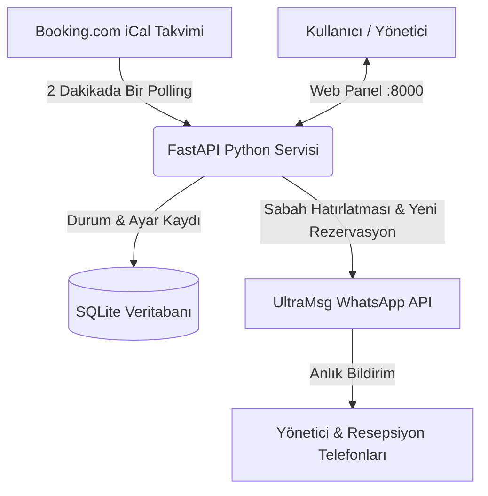

# 🏨 Booking.com WhatsApp & KBS Otomasyon Botu (Self-Hosted)

Otel, apart, villa ve butik konaklama tesisleri için geliştirilmiş; **Booking.com** rezervasyonlarını 7/24 izleyen, yeni rezervasyonları ve günlük Check-in / Check-out hatırlatmalarını yasal **KBS / Polis Kimlik Bildirimi uyarısıyla** birlikte WhatsApp üzerinden ileten, **%100 yerel (self-hosted)** otomasyon platformu.

---

## 🌟 Öne Çıkan Özellikler

- 🛎 **Anlık Rezervasyon Bildirimi:** Booking.com iCal takvimini 2 dakikada bir otomatik tarar; yeni rezervasyon düştüğü an yöneticiye veya personele WhatsApp mesajı iletir.
- 🚨 **KBS / Polis Kimlik Bildirimi Hatırlatıcıları:** 
  - Her sabah belirlediğiniz saatte (örn. `09:00`) o günkü girişler için kimlik bildirimi uyarısı.
  - O günkü çıkışlar için oda temizlik hazırlığı ve KBS çıkış bildirimi uyarısı.
- 🌐 **Modern & Responsive Web Paneli:** `http://<IP>:8000` adresinden erişilebilen, Tailwind CSS ile tasarlanmış Türkçe yönetim arayüzü.
- 🕒 **Akıllı Saat & Durum Takibi:** Çıkış günü saat 11:00 öncesi *"Bugün Çıkış"*, saat 11:00 sonrası otomatik olarak *"Çıkış Yaptı"* rozetine geçer.
- 📱 **Çoklu Numara & Grup Bildirimi:** Virgülle ayrılmış birden fazla telefon numarasına (`+905...,+905...`) veya personele ait WhatsApp grubuna aynı anda bildirim gönderir.
- ✏️ **Dinamik Mesaj Şablonları:** WhatsApp mesaj şablonlarını (`{suite_name}`, `{checkin}`, `{checkout}`) web arayüzünden tek tıkla özelleştirebilme.
- 💾 **Kalıcı SQLite Hafızası:** Sunucu yeniden başlasa bile veriler kaybolmaz, aynı rezervasyon için mükerrer mesaj atmaz.
- 🚀 **Sıfır Bulut Maliyeti:** Make.com veya Zapier gibi aylık kota sınırlaması olan servisler yerine kendi Proxmox sunucunuzda ücretsiz çalışır.

---

## 🏗️ Mimari Şema



---

## 🚀 Hızlı Kurulum

### 1. Adım: Proxmox'ta LXC Konteyneri Oluşturma (1 Dakika)

Proxmox arayüzünüzden (`https://<proxmox-ip>:8006`) sağ üstteki **"Create CT"** butonuna basarak hafif bir Linux konteyneri açın:
- **Hostname:** `booking-bot` (veya dilediğiniz bir isim)
- **Template:** `Debian 12` veya `Debian 13` (veya `Ubuntu 22.04 / 24.04`)
- **Disk:** `4 GB` veya `8 GB`
- **CPU:** `1 Core`
- **RAM:** `512 MB` *(Bot oldukça hafiftir, arka planda sadece ~70-80 MB RAM tüketir)*
- **Network:** `DHCP` (veya statik yerel IP)

Konteyneri oluşturduktan sonra **"Start"** butonuna basıp **">_ Console"** sekmesini açın.

---

### 2. Adım: Gerekli Paketleri Yükleyin ve Depoyu Klonlayın

Konteyner konsolunda şu komutları çalıştırın:

```bash
# Temel sistem paketlerini yükleyin
apt update -y && apt install -y git python3 python3-pip python3-venv

# Projeyi klonlayın ve klasöre girin
git clone https://github.com/MrCoolice/booking-whatsapp-bot.git /opt/dalaman-suite-bot
cd /opt/dalaman-suite-bot
```

---

### 3. Adım: Otomatik Kurulum Scriptini Çalıştırın

```bash
chmod +x install.sh
./install.sh
```

Script otomatik olarak:
- İzole Python sanal ortamını (`venv`) oluşturur,
- Gerekli kütüphaneleri (`fastapi`, `uvicorn`, `apscheduler`, `requests`, `python-multipart`, `jinja2`) yükler,
- `dalaman-bot.service` dosyasını Linux systemd servislerine kaydedip 7/24 arka planda otomatik çalışacak şekilde başlatır.

---

### 4. Adım: Web Paneline Giriş Yapın ve Kullanmaya Başlayın

Kurulum bittiğinde ekranda beliren IP adresiyle tarayıcınızdan panele gidin:  
👉 **`http://<KONTEYNER-IP>:8000`**

Paneldeki **Sistem Ayarları** bölümünden:
1. **Tesis / Oda Adı**
2. **WhatsApp Numaraları** (örn. `+90542XXXXXXX`)
3. **UltraMsg Instance & Token** bilgileri
4. **Booking.com iCal Linki** (.ics)

bilgilerini girip **"Tüm Ayarları ve Şablonları Kaydet"** butonuna basmanız yeterlidir!

---

## 🔑 Gerekli Bilgileri Alma Rehberi

### 1. UltraMsg Instance ID & Token Nasıl Alınır?
1. [UltraMsg.com](https://ultramsg.com) adresine gidin ve hesap oluşturun.
2. Kontrol panelinden **"Add Instance"** butonuna tıklayarak yeni bir WhatsApp örneği açın.
3. Sayfada size özel üretilen **Instance ID** (örn: `instance123456`) ve **Token** kodlarını kopyalayın.
4. Telefonunuzdaki WhatsApp uygulamasını açın:  
   👉 **Ayarlar > Bağlı Cihazlar > Cihaz Bağla** adımlarını izleyin ve UltraMsg ekranında beliren **QR Kodu** telefonunuza okutun.  
   *(Ekranda "Connected" yazdığı an sisteminiz WhatsApp mesajı göndermeye hazırdır).*

### 2. Booking.com iCal Linki (.ics) Nasıl Alınır?
1. [Booking.com Extranet](https://admin.booking.com) hesabınıza giriş yapın.
2. Üst menüden **Fiyatlar ve Kontenjan > Takvimleri Senkronize Et** sayfasına gidin.
3. İlgili odanın/süitin altında bulunan **"Takvimi Dışa Aktar" (Export Calendar)** butonuna tıklayın.
4. Ekrana gelen `https://ical.booking.com/v1/export?t=...` formatındaki **.ics takvim bağlantısını kopyalayın**.
5. Bu linki web panelinizdeki **"Booking iCal Linki"** alanına yapıştırın.

---

## ⚙️ Servis Yönetimi

```bash
# Servis durumunu kontrol etme
systemctl status dalaman-bot

# Servisi yeniden başlatma
systemctl restart dalaman-bot

# Servisi durdurma
systemctl stop dalaman-bot

# Canlı sistem loglarını izleme
journalctl -u dalaman-bot -f
```

---

## 🛠️ Kullanılan Teknolojiler

- **Backend:** Python 3, FastAPI, Uvicorn, APScheduler, Requests, SQLite
- **Frontend:** Jinja2 Templates, Tailwind CSS, FontAwesome
- **WhatsApp Gateway:** UltraMsg REST API
- **Altyapı:** Proxmox VE (LXC Debian 12 / 13)

---

## 📄 Lisans

Bu proje [MIT Lisansı](LICENSE) ile lisanslanmıştır. Dilediğiniz gibi geliştirebilir ve kendi tesislerinizde kullanabilirsiniz.

---

**Geliştirici:** [Ulaş Özbek (GölgeSiber)](https://golgesiber.com)