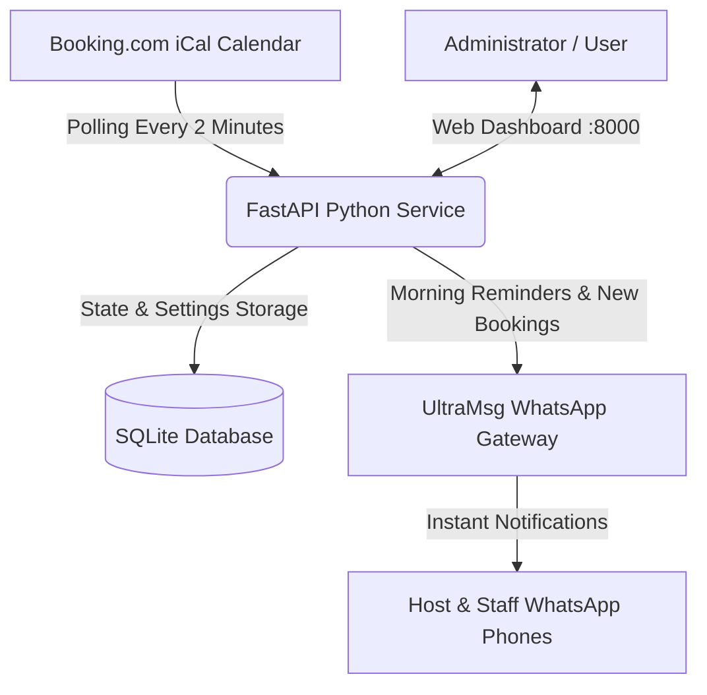
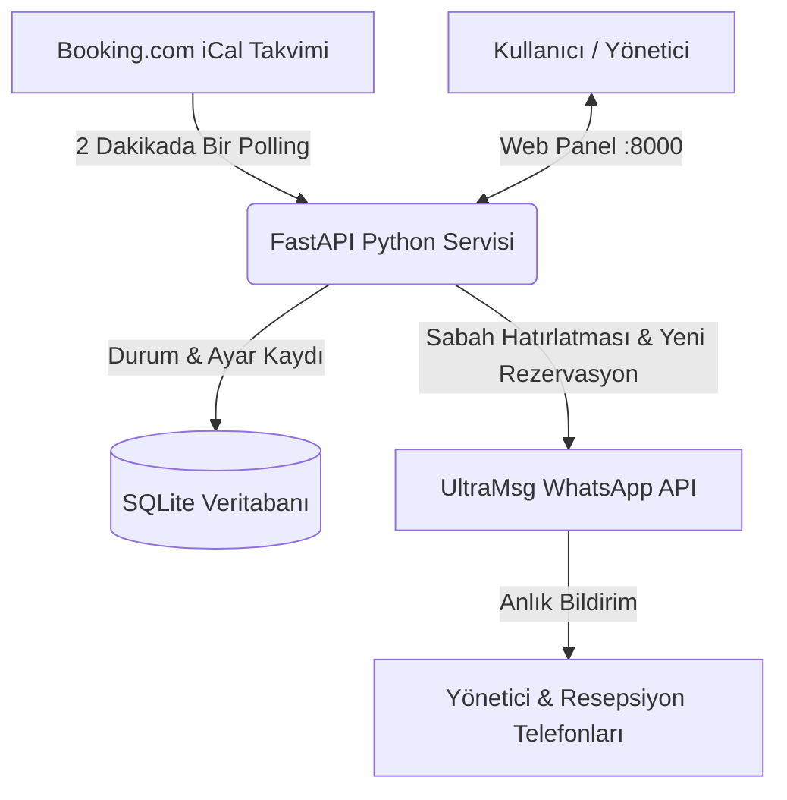

# 🏨 Booking.com WhatsApp & Legal Compliance (KBS) Automation Bot (Self-Hosted)

> 🌐 **Language / Dil:** [🇬🇧 English](#-english) | [🇹🇷 Türkçe](#-türkçe)  
> *English documentation is at the top. Türkçe açıklamalar sayfanın alt kısmında yer almaktadır.*

---

# 🇬🇧 English

A 100% **self-hosted**, lightweight, and automated bot designed for hotels, apartments, boutique villas, and short-term rentals. It monitors your **Booking.com** reservations 24/7 via iCal, notifies you instantly on WhatsApp for new bookings, and sends morning Check-in / Check-out reminders with legal police/identity reporting compliance notices (**Turkish KBS / Police Notification System**).

---

## 🌟 Key Features

- 🛎 **Instant Booking Alerts:** Automatically polls the Booking.com iCal feed every 2 minutes. When a new reservation arrives, it sends an immediate WhatsApp notification to the host, reception, or staff group.
- 🚨 **Legal Compliance & Police (KBS) Reminders:** 
  - Morning Check-in alert (`09:00` by default): Reminds staff of key handover and mandatory police guest registration.
  - Morning Check-out alert: Reminds staff to start housekeeping and file the police check-out notification.
- 🌐 **Modern & Responsive Web Dashboard:** Accessible at `http://<IP>:8000`, built with Tailwind CSS, showing today's arrivals, departures, live logs, and active reservations.
- 🕒 **Smart Status Transition:** On check-out day, the reservation badge shows *"Check-out Today"* before 11:00 AM, and automatically turns into *"Checked Out"* after standard check-out time (11:00 AM).
- 📱 **Multi-Number & WhatsApp Group Support:** Delivers alerts to multiple comma-separated phone numbers (`+905...,+905...`) or directly to a shared WhatsApp staff group.
- ✏️ **Customizable Message Templates:** Edit WhatsApp notification templates (`{suite_name}`, `{checkin}`, `{checkout}`) directly from the web dashboard with a single click.
- 💾 **Persistent SQLite Database:** Retains state across server reboots, ensuring no duplicate messages are ever sent.
- 🚀 **Zero Cloud Subscription Fees:** Runs entirely on your own local server (Proxmox LXC, Raspberry Pi, or Linux VPS) with no monthly quotas (unlike Make.com or Zapier).

---

## 🏗️ Architecture Diagram



---

## 🚀 Quick Start & Installation

### Step 1: Create a Proxmox LXC Container (1 Minute)
From your Proxmox web interface (`https://<proxmox-ip>:8006`), click **"Create CT"**:
- **Hostname:** `booking-bot`
- **Template:** `Debian 12` or `Debian 13` (or `Ubuntu 22.04 / 24.04`)
- **Disk:** `4 GB` or `8 GB`
- **CPU:** `1 Core`
- **RAM:** `512 MB` *(The bot consumes only ~70-80 MB of RAM)*
- **Network:** `DHCP` (or static local IP)

Start the container and open the **">_ Console"** tab.

---

### Step 2: Install Packages & Clone the Repository
Inside the container console, run:

```bash
# Update and install required packages
apt update -y && apt install -y git python3 python3-pip python3-venv

# Clone this repository and enter the directory
git clone https://github.com/MrCoolice/booking-whatsapp-bot.git /opt/dalaman-suite-bot
cd /opt/dalaman-suite-bot
```

---

### Step 3: Run the 1-Click Installer Script

```bash
chmod +x install.sh
./install.sh
```

The script automatically:
- Creates an isolated Python virtual environment (`venv`),
- Installs dependencies (`fastapi`, `uvicorn`, `apscheduler`, `requests`, `python-multipart`, `jinja2`),
- Configures and starts the systemd service (`dalaman-bot.service`) to run 24/7 in the background.

---

### Step 4: Open the Web Dashboard & Configure

Open your browser and navigate to:  
👉 **`http://<CONTAINER-IP>:8000`**

In the **System Settings** section on the right:
1. Enter your **Property / Suite Name**
2. Enter your **WhatsApp Number(s)** (e.g., `+90542XXXXXXX`)
3. Enter your **UltraMsg Instance ID & Token**
4. Paste your **Booking.com iCal Link** (.ics)
5. Click **"Save All Settings & Templates"**.

---

## 🔑 Configuration Guide

### How to Get Your UltraMsg Instance ID & Token:
1. Go to [UltraMsg.com](https://ultramsg.com) and create an account.
2. In the dashboard, click **"Add Instance"** to create a WhatsApp instance.
3. Copy the generated **Instance ID** (e.g., `instance123456`) and **Token**.
4. Open WhatsApp on your phone: navigate to **Settings > Linked Devices > Link a Device**, and scan the QR code displayed on UltraMsg.  
   *(Once it shows "Connected", your WhatsApp gateway is active).*

### How to Get Your Booking.com iCal Export Link:
1. Log in to [Booking.com Extranet](https://admin.booking.com).
2. Go to **Rates & Availability > Sync Calendars**.
3. Under the desired room/suite, click **"Export Calendar"**.
4. Copy the provided `.ics` URL (e.g., `https://ical.booking.com/v1/export?t=...`).
5. Paste this URL into the **"Booking iCal Link"** field in the bot's web dashboard.

---

## ⚙️ Service Management

```bash
# Check service status
systemctl status dalaman-bot

# Restart service
systemctl restart dalaman-bot

# Stop service
systemctl stop dalaman-bot

# View live real-time logs
journalctl -u dalaman-bot -f
```

---

<br><br>

---

# 🇹🇷 Türkçe

Otel, apart, villa ve butik konaklama tesisleri için geliştirilmiş; **Booking.com** rezervasyonlarını 7/24 izleyen, yeni rezervasyonları ve günlük Check-in / Check-out hatırlatmalarını yasal **KBS / Polis Kimlik Bildirimi uyarısıyla** birlikte WhatsApp üzerinden ileten, **%100 yerel (self-hosted)** otomasyon platformu.

---

## 🌟 Öne Çıkan Özellikler

- 🛎 **Anlık Rezervasyon Bildirimi:** Booking.com iCal takvimini 2 dakikada bir otomatik tarar; yeni rezervasyon düştüğü an yöneticiye veya personele WhatsApp mesajı iletir.
- 🚨 **KBS / Polis Kimlik Bildirimi Hatırlatıcıları:** 
  - Her sabah belirlediğiniz saatte (örn. `09:00`) o günkü girişler için kimlik bildirimi uyarısı.
  - O günkü çıkışlar için oda temizlik hazırlığı ve KBS çıkış bildirimi uyarısı.
- 🌐 **Modern & Responsive Web Paneli:** `http://<IP>:8000` adresinden erişilebilen, Tailwind CSS ile tasarlanmış Türkçe yönetim arayüzü.
- 🕒 **Akıllı Saat & Durum Takibi:** Çıkış günü saat 11:00 öncesi *"Bugün Çıkış"*, saat 11:00 sonrası otomatik olarak *"Çıkış Yaptı"* rozetine geçer.
- 📱 **Çoklu Numara & Grup Bildirimi:** Virgülle ayrılmış birden fazla telefon numarasına (`+905...,+905...`) veya personele ait WhatsApp grubuna aynı anda bildirim gönderir.
- ✏️ **Dinamik Mesaj Şablonları:** WhatsApp mesaj şablonlarını (`{suite_name}`, `{checkin}`, `{checkout}`) web arayüzünden tek tıkla özelleştirebilme.
- 💾 **Kalıcı SQLite Hafızası:** Sunucu yeniden başlasa bile veriler kaybolmaz, aynı rezervasyon için mükerrer mesaj atmaz.
- 🚀 **Sıfır Bulut Maliyeti:** Make.com veya Zapier gibi aylık kota sınırlaması olan servisler yerine kendi Proxmox sunucunuzda ücretsiz çalışır.

---

## 🏗️ Mimari Şema



---

## 🚀 Hızlı Kurulum

### 1. Adım: Proxmox'ta LXC Konteyneri Oluşturma (1 Dakika)
Proxmox arayüzünüzden (`https://<proxmox-ip>:8006`) sağ üstteki **"Create CT"** butonuna basarak hafif bir Linux konteyneri açın:
- **Hostname:** `booking-bot`
- **Template:** `Debian 12` veya `Debian 13` (veya `Ubuntu 22.04 / 24.04`)
- **Disk:** `4 GB` veya `8 GB`
- **CPU:** `1 Core`
- **RAM:** `512 MB` *(Bot oldukça hafiftir, arka planda sadece ~70-80 MB RAM tüketir)*
- **Network:** `DHCP` (veya statik yerel IP)

Konteyneri oluşturduktan sonra **"Start"** butonuna basıp **">_ Console"** sekmesini açın.

---

### 2. Adım: Gerekli Paketleri Yükleyin ve Depoyu Klonlayın

```bash
# Temel sistem paketlerini yükleyin
apt update -y && apt install -y git python3 python3-pip python3-venv

# Projeyi klonlayın ve klasöre girin
git clone https://github.com/MrCoolice/booking-whatsapp-bot.git /opt/dalaman-suite-bot
cd /opt/dalaman-suite-bot
```

---

### 3. Adım: Otomatik Kurulum Scriptini Çalıştırın

```bash
chmod +x install.sh
./install.sh
```

Script otomatik olarak:
- İzole Python sanal ortamını (`venv`) oluşturur,
- Gerekli kütüphaneleri (`fastapi`, `uvicorn`, `apscheduler`, `requests`, `python-multipart`, `jinja2`) yükler,
- `dalaman-bot.service` dosyasını Linux systemd servislerine kaydedip 7/24 arka planda otomatik çalışacak şekilde başlatır.

---

### 4. Adım: Web Paneline Giriş Yapın ve Kullanmaya Başlayın

Kurulum bittiğinde ekranda beliren IP adresiyle tarayıcınızdan panele gidin:  
👉 **`http://<KONTEYNER-IP>:8000`**

Paneldeki **Sistem Ayarları** bölümünden:
1. **Tesis / Oda Adı**
2. **WhatsApp Numaraları** (örn. `+90542XXXXXXX`)
3. **UltraMsg Instance & Token** bilgileri
4. **Booking.com iCal Linki** (.ics)

bilgilerini girip **"Tüm Ayarları ve Şablonları Kaydet"** butonuna basmanız yeterlidir!

---

## 🔑 Gerekli Bilgileri Alma Rehberi

### 1. UltraMsg Instance ID & Token Nasıl Alınır?
1. [UltraMsg.com](https://ultramsg.com) adresine gidin ve hesap oluşturun.
2. Kontrol panelinden **"Add Instance"** butonuna tıklayarak yeni bir WhatsApp örneği açın.
3. Sayfada size özel üretilen **Instance ID** (örn: `instance123456`) ve **Token** kodlarını kopyalayın.
4. Telefonunuzdaki WhatsApp uygulamasını açın:  
   👉 **Ayarlar > Bağlı Cihazlar > Cihaz Bağla** adımlarını izleyin ve UltraMsg ekranında beliren **QR Kodu** telefonunuza okutun.  
   *(Ekranda "Connected" yazdığı an sisteminiz WhatsApp mesajı göndermeye hazırdır).*

### 2. Booking.com iCal Linki (.ics) Nasıl Alınır?
1. [Booking.com Extranet](https://admin.booking.com) hesabınıza giriş yapın.
2. Üst menüden **Fiyatlar ve Kontenjan > Takvimleri Senkronize Et** sayfasına gidin.
3. İlgili odanın/süitin altında bulunan **"Takvimi Dışa Aktar" (Export Calendar)** butonuna tıklayın.
4. Ekrana gelen `https://ical.booking.com/v1/export?t=...` formatındaki **.ics takvim bağlantısını kopyalayın**.
5. Bu linki web panelinizdeki **"Booking iCal Linki"** alanına yapıştırın.

---

## ⚙️ Servis Yönetimi

```bash
# Servis durumunu kontrol etme
systemctl status dalaman-bot

# Servisi yeniden başlatma
systemctl restart dalaman-bot

# Servisi durdurma
systemctl stop dalaman-bot

# Canlı sistem loglarını izleme
journalctl -u dalaman-bot -f
```

---

## 🛠️ Kullanılan Teknolojiler

- **Backend:** Python 3, FastAPI, Uvicorn, APScheduler, Requests, SQLite
- **Frontend:** Jinja2 Templates, Tailwind CSS, FontAwesome
- **WhatsApp Gateway:** UltraMsg REST API
- **Altyapı:** Proxmox VE (LXC Debian 12 / 13)

---

## 📄 Lisans

Bu proje [MIT Lisansı](LICENSE) ile lisanslanmıştır. Dilediğiniz gibi geliştirebilir ve kendi tesislerinizde kullanabilirsiniz.

---

**Geliştirici:** [Ulaş Özbek (GölgeSiber)](https://golgesiber.com)