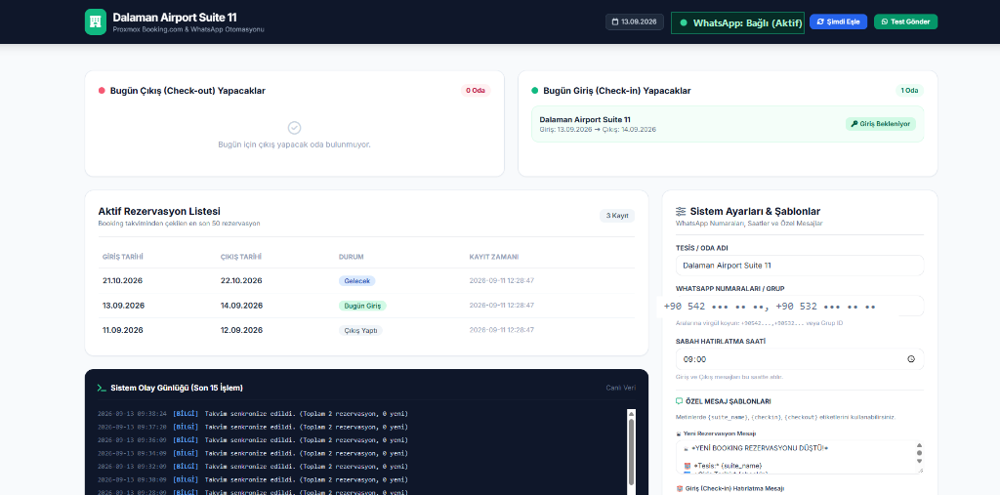
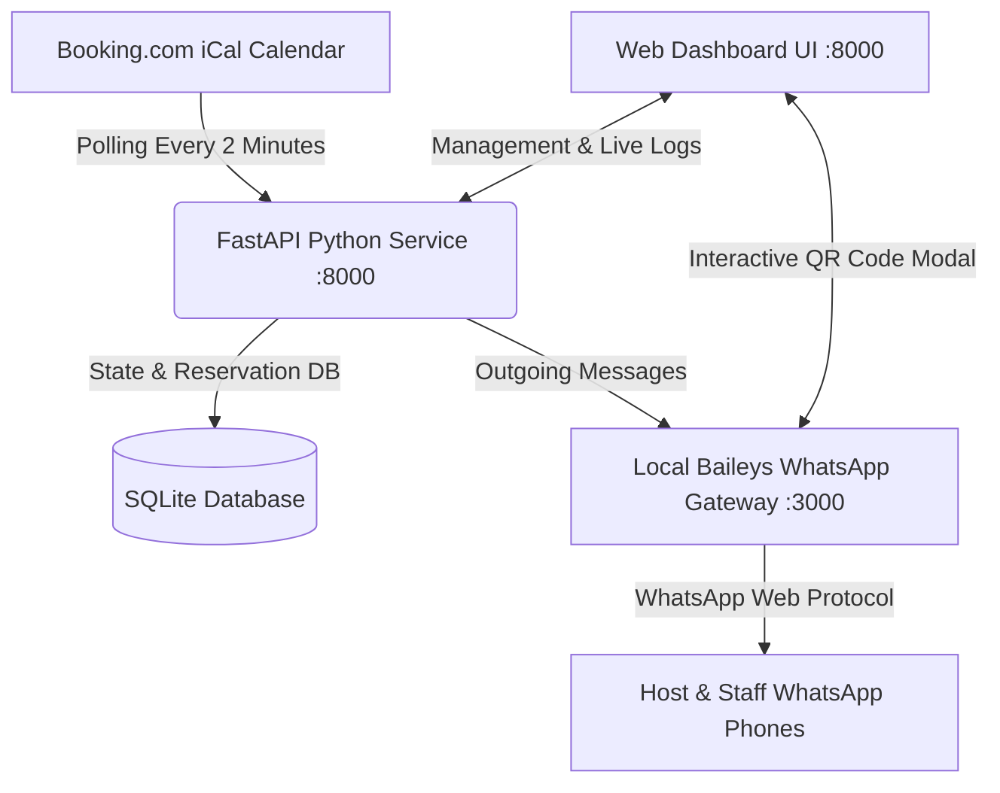
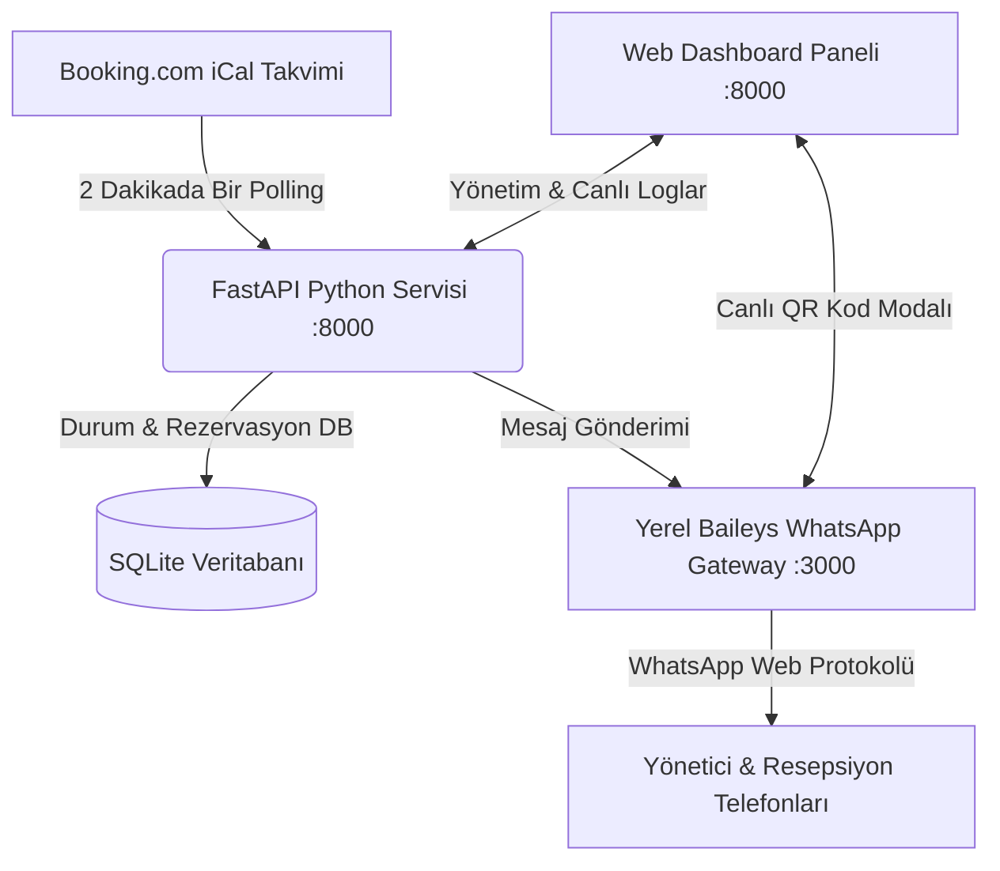

# 🏨 Booking.com WhatsApp & Legal Compliance (KBS) Automation Bot (Self-Hosted)

> 🌐 **Language / Dil:** [🇬🇧 English](#-english) | [🇹🇷 Türkçe](#-türkçe)  
> *English documentation is at the top. Türkçe açıklamalar sayfanın alt kısmında yer almaktadır.*

---

# 🇬🇧 English

A 100% **self-hosted**, lightweight, and automated bot designed for hotels, apartments, boutique villas, and short-term rentals. It monitors your **Booking.com** reservations 24/7 via iCal, notifies you instantly on WhatsApp for new bookings, and sends morning Check-in / Check-out reminders with legal police/identity reporting compliance notices (**Turkish KBS / Police Notification System**).

Includes a built-in **100% Free Self-Hosted WhatsApp Web Gateway (Baileys)**: no paid third-party APIs, no trial expirations, and zero monthly subscriptions!



---

## 🖥️ Modern 4-Tab Web Dashboard (`http://<SERVER-IP>:8000`)

The web dashboard is organized into 4 intuitive tabs for clutter-free operations:

1. **🏨 Reception & Active Guests (`Resepsiyon & Misafirler`):**
   - **Live KPI Counter Cards:** Real-time metrics for Total Reservations, Today's Check-ins, Current Stays, Today's Check-outs, and Upcoming Arrivals.
   - **Instant Filter Pills & Search:** Filter bookings instantly by status (*All*, *Today's Check-in*, *Staying*, *Today's Check-out*, *Upcoming*) or search by name/UID in real-time.
   - **Guest Language Badges:** Automatically identifies guest language (🇩🇪 DE, 🇷🇺 RU, 🇹🇷 TR, 🇬🇧 EN) based on phone country code.
   - **Interactive Action Buttons:**
     - `[Karşıla]` (Welcome & Wi-Fi in guest's native language)
     - `[🎁 Uzat]` (Send €75 stay extension upsell offer)
     - `[🔔 Bildir]` (Re-dispatch new reservation alert to staff)

2. **🧪 Test & Sandbox Laboratory (`Test Laboratuvarı`):**
   - **Safe Sandbox Mode Toggle:** Redirects all outbound guest notifications to the host's test phone (`+905423674599`) so real guests are never disturbed during testing.
   - **1-Click Multilingual Test Dispatches:** Pre-built test triggers for Welcome messages (🇩🇪 German, 🇷🇺 Russian, 🇹🇷 Turkish, 🇬🇧 English), Stay Extension (€75), and %10 Web Discount Kupon (`DAS10`).

3. **📢 Direct Marketing & CRM (`CRM & Kampanyalar`):**
   - **Targeted Seasonal & Flight Campaigns:** Send customized WhatsApp broadcast offers to past guests.
   - **Anti-Spam Throttling:** Built-in 10-second delay between outgoing messages to safeguard WhatsApp number reputation.

4. **⚙️ Settings & Integration (`Ayarlar & Entegrasyon`):**
   - **Property & Calendar Config:** Set property name, staff WhatsApp numbers, and Booking.com iCal URL.
   - **Automatic 15:00 Check-in Welcome:** Toggle fully hands-free automated dispatch of Welcome & Wi-Fi messages at check-in time (`15:00`).
   - **Stay Extension Pricing:** Configure default extension price (`€75`) and evening offer dispatch hour (`20:00`).
   - **6 Customizable Message Templates:** Rich textarea editors for all automated templates (`msg_welcome`, `msg_extension`, `msg_discount_confirmed`, `msg_new_booking`, `msg_checkin`, `msg_checkout`) with dynamic variable tags (`{suite_name}`, `{checkin}`, `{checkout}`, `{price}`, `{discount_code}`).
   - **Live Event Log Console:** Real-time stream of calendar syncs, WhatsApp deliveries, and automated scheduler actions.

---

## 🌟 Key Features

- 🆓 **100% Free Self-Hosted WhatsApp Gateway:** Powered by Baileys & Node.js running directly on your server. Pair your phone once via QR code directly in the web UI. No paid subscriptions, no per-message fees!
- 🌐 **4-Language Native Guest Messaging:** Automatically detects guest nationality (German 🇩🇪, Russian 🇷🇺, Turkish 🇹🇷, English 🇬🇧) from their phone dial code and sends tailored localized messages.
- 🕒 **Zero-Click Automatic 15:00 Welcome Dispatch:** Automatically fires at 15:00 on arrival day, welcoming guests with Wi-Fi passwords, Google Maps navigation pin, and direct website link (`https://dalamanairportsuites.com/`).
- 🤖 **Two-Way Conversational Webhook:** When guests reply `"EVET"` / `"YES"` / `"DAS10"`, the bot immediately returns their %10 direct booking discount coupon (`DAS10`) and instantly pings the host on WhatsApp.
- 🧪 **Safe Sandbox Environment:** Toggle Sandbox Mode with one click to test every automated scenario safely on your personal phone before going live.
- 🛎 **Instant Booking Alerts:** Automatically polls the Booking.com iCal feed every 2 minutes. When a new reservation arrives, it sends an immediate WhatsApp notification to the host or reception group.
- 🚨 **Legal Compliance & Police (KBS) Reminders:** Morning Check-in and Check-out alerts to remind staff of key handover, housekeeping, and mandatory police identity reporting.
- 🛡️ **Fail-Safe & Self-Healing Scheduler:** Uses `>= morning_time` database evaluation so no morning or evening notifications are ever skipped even after server reboots.
- 🎁 **Smart Last-Minute Stay Extension (Upsell):** If tomorrow is empty, the bot automatically dispatches an evening (`20:00`) extension offer at a direct discounted rate (e.g. `€75`), converting vacant nights into direct revenue.
- ✏️ **Full Template Customization:** Complete control over message wording from the Settings tab without editing source code.
- 💾 **Persistent SQLite Database:** Retains state across server reboots, guaranteeing zero duplicate messages.

---

## 🏗️ Architecture Diagram



---

## 🚀 Quick Start & Installation

### Step 1: Create a Proxmox LXC Container (1 Minute)
From your Proxmox web interface (`https://<proxmox-ip>:8006`), click **"Create CT"**:
- **Hostname:** `booking-bot`
- **Template:** `Debian 12` or `Debian 13` (or `Ubuntu 22.04 / 24.04`)
- **Disk:** `4 GB` or `8 GB`
- **CPU:** `1 Core`
- **RAM:** `512 MB` *(The bot and gateway combined consume only ~120 MB of RAM)*
- **Network:** `DHCP` (or static local IP)

Start the container and open the **">_ Console"** tab.

---

### Step 2: Install Packages & Clone the Repository
Inside the container console, run:

```bash
# Update and install required packages
apt update -y && apt install -y git python3 python3-pip python3-venv nodejs npm

# Clone this repository and enter the directory
git clone https://github.com/MrCoolice/booking-whatsapp-bot.git /opt/dalaman-suite-bot
cd /opt/dalaman-suite-bot
```

---

### Step 3: Run the 1-Click Installer Script

```bash
chmod +x install.sh
./install.sh
```

The script automatically:
- Creates an isolated Python virtual environment (`venv`),
- Installs Python dependencies (`fastapi`, `uvicorn`, `apscheduler`, `requests`, `jinja2`, etc.),
- Installs WhatsApp Gateway Node.js dependencies (`@whiskeysockets/baileys`, `express`, `qrcode`),
- Configures and starts both systemd services (`dalaman-bot` on `:8000` and `dalaman-gateway` on `:3000`) to run 24/7 in the background.

---

### Step 4: Open Web Dashboard & Link Your WhatsApp

1. Open your browser and navigate to:  
   👉 **`http://<CONTAINER-IP>:8000`**
2. In the top right header, click the **"WhatsApp"** status button (it will show *QR Bekleniyor* or *Kontrol Ediliyor*).
3. A popup will display the WhatsApp pairing QR code.
4. On your phone, open WhatsApp:  
   👉 **Settings > Linked Devices > Link a Device** and scan the QR code on your screen.
5. The badge will instantly turn green: **"🟢 WhatsApp: Aktif (+90...)"**.

*(Alternatively, you can view the QR code directly at `http://<CONTAINER-IP>:3000/qr-view`).*

---

### Step 5: Configure Booking.com iCal Link

In the **System Settings** section on the right side of the dashboard:
1. Enter your **Property / Suite Name**
2. Enter your **WhatsApp Phone Number(s)** (e.g., `+90542XXXXXXX`)
3. Paste your **Booking.com iCal Link** (.ics)
4. Click **"Save All Settings & Templates"**.

---

## 🔑 How to Get Your Booking.com iCal Export Link

1. Log in to [Booking.com Extranet](https://admin.booking.com).
2. Go to **Rates & Availability > Sync Calendars**.
3. Under the desired room/suite, click **"Export Calendar"**.
4. Copy the provided `.ics` URL (e.g., `https://ical.booking.com/v1/export?t=...`).
5. Paste this URL into the **"Booking iCal Link"** field in the bot's web dashboard.

---

## ⚙️ Service Management

Both services are managed seamlessly via `systemd`:

```bash
# Python Bot (Port 8000)
systemctl status dalaman-bot
systemctl restart dalaman-bot
journalctl -u dalaman-bot -f

# WhatsApp Gateway (Port 3000)
systemctl status dalaman-gateway
systemctl restart dalaman-gateway
journalctl -u dalaman-gateway -f
```

---

<br><br>

---

# 🇹🇷 Türkçe

Otel, apart, villa ve butik konaklama tesisleri için geliştirilmiş; **Booking.com** rezervasyonlarını 7/24 izleyen, yeni rezervasyonları ve günlük Check-in / Check-out hatırlatmalarını yasal **KBS / Polis Kimlik Bildirimi uyarısıyla** birlikte WhatsApp üzerinden ileten, **%100 yerel (self-hosted)** otomasyon platformu.

Sistem, bünyesinde barındırdığı **%100 Ücretsiz Yerel WhatsApp Gateway (Baileys)** sayesinde üçüncü parti ücretli API'lere (UltraMsg, Twilio vb.) aylık abonelik ödemenize gerek kalmadan tamamen kendi sunucunuz üzerinden çalışır!


---

## 🖥️ Modern 4 Sekmeli Web Yönetim Paneli (`http://<SUNUCU-IP>:8000`)

Yönetim paneli tüm operasyonları karmaşadan uzak, 4 mantıksal sekmeyle yönetmenizi sağlar:

1. **🏨 Resepsiyon & Misafirler Sekmesi:**
   - **Canlı KPI İstatistik Kartları:** Toplam Rezervasyon, Bugün Giriş, Konaklayanlar, Bugün Çıkış ve Gelecek Rezervasyon sayılarını anlık gösterir.
   - **Filtre Hapları (Pills) & Canlı Arama:** Rezervasyonları tek tıkla (*Tümü*, *Bugün Giriş*, *Konaklayanlar*, *Bugün Çıkış*, *Gelecek*) filtreleyebilir, isim veya rezervasyon koduna göre anlık arayabilirsiniz.
   - **Otomatik Dil Rozetleri:** Misafirin telefon ülke koduna göre ana dilini tespit eder (🇩🇪 DE, 🇷🇺 RU, 🇹🇷 TR, 🇬🇧 EN).
   - **Aksiyon Butonları:**
     - `[Karşıla]` (Misafirin ana dilinde Wi-Fi & karşılama mesajı)
     - `[🎁 Uzat]` (Ertesi gün boşsa €75 indirimli doğrudan uzatma teklifi)
     - `[🔔 Bildir]` (İlgili rezervasyonun personel bildirimini tekrar gönder)

2. **🧪 Test Laboratuvarı Sekmesi:**
   - **Güvenli Sandbox (İzolasyon) Modu:** Tüm giden mesajları misafirleri hiç rahatsız etmeden doğrudan yöneticinin test telefonuna (`+905423674599`) yönlendirir.
   - **Tek Tıkla 4 Dilde Test Gönderimi:** Karşılama mesajları (🇩🇪 Almanca, 🇷🇺 Rusça, 🇹🇷 Türkçe, 🇬🇧 İngilizce), Konaklama Uzatma (€75) ve %10 Doğrudan İndirim Kuponu (`DAS10`) için tek tıkla test butonları.

3. **📢 CRM & Kampanyalar Sekmesi:**
   - **Sezonluk ve Uçuş İndirim Kampanyaları:** Geçmiş misafirlere doğrudan WhatsApp duyuruları hazırlayıp gönderme modülü.
   - **10 Saniyelik Anti-Spam Koruması:** WhatsApp numarasının güvenliği için mesajlar arasına otomatik gecikme uygular.

4. **⚙️ Ayarlar & Entegrasyon Sekmesi:**
   - **Tesis & Takvim Bilgileri:** Tesis adı, personel WhatsApp numaraları ve Booking.com iCal bağlantısı.
   - **Saat 15:00 Otomatik Karşılama:** Bugün giriş yapacak misafirlere saat 15:00'te sıfır tıklamayla otomatik karşılama mesajı gönderme anahtarı ve saat ayarı.
   - **Uzatma Fiyatı:** Standart uzatma fiyatı (`€75`) ve akşam teklif saati (`20:00`).
   - **6 Adet Zengin Mesaj Şablonu:** Sistemdeki tüm mesajları (`msg_welcome`, `msg_extension`, `msg_discount_confirmed`, `msg_new_booking`, `msg_checkin`, `msg_checkout`) web panelinden dinamik değişkenlerle (`{suite_name}`, `{checkin}`, `{checkout}`, `{price}`, `{discount_code}`) düzenleyebilme.
   - **Canlı Sistem Olay Günlüğü:** Takvim eşlemeleri, gönderim durumları ve planlayıcı loglarının canlı terminal akışı.

---

## 🌟 Öne Çıkan Özellikler

- 🆓 **%100 Ücretsiz & Kalıcı Yerel WhatsApp Ağ Geçidi:** Baileys & Node.js altyapısıyla kendi sunucunuzda çalışır. Web panelinden tek tıkla QR kod okutarak kendi WhatsApp numaranızı bağlayın; aylık ücret veya mesaj kotası derdini unutun.
- 🌐 **4 Dilde Otomatik Misafir Algılama:** Telefon kodundan (Almanca 🇩🇪, Rusça 🇷🇺, Türkçe 🇹🇷, İngilizce 🇬🇧) misafirin dilini anlayarak kendi dilinde özel mesaj iletir.
- 🕒 **Sıfır Tıklama ile Saat 15:00 Otomatik Karşılama:** Giriş günü saat 15:00'te misafire Wi-Fi şifresi, Google Haritalar konumu ve doğrudan web sitesi adresi (`https://dalamanairportsuites.com/`) otomatik iletilir.
- 🤖 **Çift Yönlü Akıllı Yanıt Webhook'u:** Misafir gelen teklife veya mesaja `"EVET"`, `"YES"` veya `"DAS10"` yazdığında sistem anında %10 indirim kuponunu ve web rezervasyon bağlantısını gönderir; yöneticiye anında WhatsApp'tan haber verir.
- 🧪 **Güvenli Laboratuvar & Sandbox:** Misafirlerinizi rahatsız etmeden tüm senaryoları kendi telefonunuzda (`+905423674599`) deneyebileceğiniz güvenli test modu.
- 🛎 **Anlık Rezervasyon Bildirimi:** Booking.com iCal takvimini 2 dakikada bir otomatik tarar; yeni rezervasyon düştüğü an yöneticiye veya personele WhatsApp mesajı iletir.
- 🚨 **KBS / Polis Kimlik Bildirimi Hatırlatıcıları:** Her sabah giriş yapacaklar için kimlik bildirimi, çıkış yapacaklar için temizlik hazırlığı ve KBS çıkış uyarısı.
- 🛡️ **Sıfır Mesaj Kaçırma Garantili Akıllı Zamanlayıcı:** Veritabanı durumuyla entegre `>= morning_time` algoritması sayesinde sunucu kapalı kalıp açılsa dahi sabah bildirimleri asla atlanmaz.
- 🎁 **Akıllı Son Dakika Konaklama Uzatma (Upsell) Otomasyonu:** Ertesi gün takvimde oda boşsa, bot akşam saat 20:00'de yarın çıkacak misafire indirimli nakit uzatma teklifi (`€75`) iletir; boş geceleri doğrudan nakit gelire dönüştürür.
- ✏️ **Tamamen Özelleştirilebilir Şablonlar:** 6 farklı mesaj şablonunun tamamını kod değiştirmeden Ayarlar sekmesinden düzenleme imkanı.
- 💾 **Kalıcı SQLite Hafızası:** Sunucu yeniden başlasa bile veriler korunur, mükerrer mesaj gönderimi engellenir.

---

## 🏗️ Mimari Şema



---

## 🚀 Hızlı Kurulum

### 1. Adım: Proxmox'ta LXC Konteyneri Oluşturma (1 Dakika)
Proxmox arayüzünüzden (`https://<proxmox-ip>:8006`) sağ üstteki **"Create CT"** butonuna basarak hafif bir Linux konteyneri açın:
- **Hostname:** `booking-bot`
- **Template:** `Debian 12` veya `Debian 13` (veya `Ubuntu 22.04 / 24.04`)
- **Disk:** `4 GB` veya `8 GB`
- **CPU:** `1 Core`
- **RAM:** `512 MB` *(Bot ve Gateway toplamda yalnızca ~120 MB RAM tüketir)*
- **Network:** `DHCP` (veya statik yerel IP)

Konteyneri oluşturduktan sonra **"Start"** butonuna basıp **">_ Console"** sekmesini açın.

---

### 2. Adım: Gerekli Paketleri Yükleyin ve Depoyu Klonlayın

```bash
# Temel sistem paketlerini yükleyin
apt update -y && apt install -y git python3 python3-pip python3-venv nodejs npm

# Projeyi klonlayın ve klasöre girin
git clone https://github.com/MrCoolice/booking-whatsapp-bot.git /opt/dalaman-suite-bot
cd /opt/dalaman-suite-bot
```

---

### 3. Adım: Otomatik Kurulum Scriptini Çalıştırın

```bash
chmod +x install.sh
./install.sh
```

Script otomatik olarak:
- İzole Python sanal ortamını (`venv`) oluşturur,
- Gerekli Python kütüphanelerini (`fastapi`, `uvicorn`, `apscheduler`, `requests`, `jinja2`) yükler,
- Node.js WhatsApp Gateway kütüphanelerini kurar (`@whiskeysockets/baileys`, `express`, `qrcode`),
- `dalaman-bot` (:8000) ve `dalaman-gateway` (:3000) servislerini Linux systemd'ye kaydedip 7/24 arka planda otomatik çalışacak şekilde başlatır.

---

### 4. Adım: Web Paneline Giriş ve WhatsApp Eşleme

1. Kurulum bittiğinde tarayıcınızdan panele gidin:  
   👉 **`http://<KONTEYNER-IP>:8000`**
2. Üst bardaki **"WhatsApp"** butonuna tıklayın.
3. Açılan penceredeki QR kodu telefonunuzdan okutun:  
   👉 **WhatsApp > Ayarlar > Bağlı Cihazlar > Cihaz Bağla**
4. Eşleşme tamamlandığında buton otomatik olarak **"🟢 WhatsApp: Aktif (+90...)"** şekline dönecektir.

*(Dilerseniz doğrudan `http://<KONTEYNER-IP>:3000/qr-view` adresinden de QR koda erişebilirsiniz).*

---

### 5. Adım: Rezervasyon Ayarlarını Kaydetme

Paneldeki **Sistem Ayarları** bölümünden:
1. **Tesis / Oda Adı**
2. **WhatsApp Numaraları** (örn. `+90542XXXXXXX`)
3. **Booking.com iCal Linki** (.ics)

bilgilerini girip **"Tüm Ayarları ve Şablonları Kaydet"** butonuna basmanız yeterlidir!

---

## 🔑 Booking.com iCal Linki (.ics) Nasıl Alınır?

1. [Booking.com Extranet](https://admin.booking.com) hesabınıza giriş yapın.
2. Üst menüden **Fiyatlar ve Kontenjan > Takvimleri Senkronize Et** sayfasına gidin.
3. İlgili odanın/süitin altında bulunan **"Takvimi Dışa Aktar" (Export Calendar)** butonuna tıklayın.
4. Ekrana gelen `https://ical.booking.com/v1/export?t=...` formatındaki **.ics takvim bağlantısını kopyalayın**.
5. Bu linki web panelinizdeki **"Booking iCal Linki"** alanına yapıştırın.

---

## ⚙️ Servis Yönetimi, Hata Ayıklama & Sunucu Komutları (Troubleshooting & CLI)

Sistemi yönetirken, test ederken veya olası durumları incelerken kullanabileceğiniz tüm temel ve ileri düzey konsol komutları:

### 1. Servis Durumları ve Canlı Log İzleme
```bash
# Python Web Botu Servisi (FastAPI - Port 8000)
systemctl status dalaman-bot
systemctl restart dalaman-bot
journalctl -u dalaman-bot -n 50 --no-pager
journalctl -u dalaman-bot -f                  # Canlı log takibi

# Yerel Baileys WhatsApp Gateway Servisi (Node.js - Port 3000)
systemctl status dalaman-gateway
systemctl restart dalaman-gateway
journalctl -u dalaman-gateway -n 50 --no-pager
journalctl -u dalaman-gateway -f              # Canlı WhatsApp log takibi
```

### 2. WhatsApp Oturumunu Sıfırlama (Temiz QR Eşleme)
Eğer WhatsApp'ta *"Mesaj bekleniyor. Bu işlem biraz zaman alabilir"* uyarısı görürseniz veya botu farklı bir telefona bağlamak isterseniz oturumu sıfırlayabilirsiniz:
```bash
# Eski anahtarları temizle ve temiz QR kod üret
systemctl stop dalaman-gateway && rm -rf /opt/dalaman-suite-bot/gateway/auth_info && systemctl restart dalaman-gateway
```
*Ardından `http://<IP>:8000` panelinden veya `http://<IP>:3000/qr-view` adresinden yeni QR kodu telefonunuzla okutun.*

### 3. Terminalden Doğrudan API Test ve Manuel Tetikleme Komutları
Web arayüzüne girmeden doğrudan sunucu içinden komut satırıyla test veya tetikleme yapabilirsiniz:
```bash
# 1. Takvimi anında senkronize et ve hatırlatıcıları çalıştır:
curl -X POST http://127.0.0.1:8000/api/sync-now

# 2. WhatsApp test bildirimi gönder:
curl -X POST http://127.0.0.1:8000/api/test-whatsapp

# 3. Son rezervasyon bildirimini ("Yeni Rezervasyon Düştü") WhatsApp'a tekrar gönder:
curl -X POST http://127.0.0.1:8000/api/reservation/resend-new-alert

# 4. WhatsApp Gateway bağlantı durumunu JSON olarak kontrol et:
curl -s http://127.0.0.1:3000/status
```

### 4. SQLite Veritabanı İnceleme ve Sorgu Komutları
Veritabanındaki kayıtları doğrudan terminalden incelemek veya manuel kontrol etmek için:
```bash
# Kayıtlı son 5 rezervasyonu listele:
sqlite3 /opt/dalaman-suite-bot/bot_database.db "SELECT uid, checkin, checkout, notified_new, notified_checkout FROM reservations ORDER BY checkin DESC LIMIT 5;"

# Son 10 sistem olay günlüğünü incele:
sqlite3 /opt/dalaman-suite-bot/bot_database.db "SELECT timestamp, status, message FROM logs ORDER BY id DESC LIMIT 10;"

# Bir rezervasyonun 'Yeni Rezervasyon' bildirim bayrağını sıfırla (tekrar tetiklemek için):
sqlite3 /opt/dalaman-suite-bot/bot_database.db "UPDATE reservations SET notified_new = 0 ORDER BY created_at DESC LIMIT 1;"
```

### 5. Port ve Ağ Durumu Kontrolü
```bash
# 8000 (Web Paneli) ve 3000 (WhatsApp Gateway) portlarını kontrol et:
ss -tulpn | grep -E '8000|3000'
```

### 6. Tek Komutla Güncelleme Çekme (Update)
GitHub deposuna yapılan yeni güncellemeleri ve hata düzeltmelerini tek komutla sunucuya almak için:
```bash
cd /opt/dalaman-suite-bot && git pull && systemctl restart dalaman-gateway && systemctl restart dalaman-bot
```

---

## 🛠️ Kullanılan Teknolojiler

- **Backend:** Python 3, FastAPI, Uvicorn, APScheduler, Requests, SQLite
- **WhatsApp Gateway:** Node.js, Express, [@whiskeysockets/baileys](https://github.com/WhiskeySockets/Baileys), QRCode
- **Frontend:** Jinja2 Templates, Tailwind CSS, FontAwesome
- **Altyapı:** Proxmox VE (LXC Debian 12 / 13), Systemd

---

## 📄 Lisans

Bu proje [MIT Lisansı](LICENSE) ile lisanslanmıştır. Dilediğiniz gibi geliştirebilir ve kendi tesislerinizde kullanabilirsiniz.

---

## 📝 Sürüm Notları / Changelog

- **v1.4.0 (14 Eylül 2026):**
  - **4 Sekmeli Modern Yönetim Paneli:** Resepsiyon & Misafirler, Test Laboratuvarı, CRM & Kampanyalar ve Ayarlar & Entegrasyon sekmeleri ile karmaşadan uzak temiz arayüz.
  - **Dinamik Tablo Filtreleme & Arama:** Rezervasyonları anlık durumlarına göre (Tümü, Bugün Giriş, Konaklayanlar, Bugün Çıkış, Gelecek) filtreleme ve canlı arama.
  - **4 Dilde Akıllı Misafir Algılama:** Misafir telefon koduna göre (🇩🇪 Almanca, 🇷🇺 Rusça, 🇹🇷 Türkçe, 🇬🇧 İngilizce) otomatik dil belirleme ve ilgili dilde şablon oluşturma.
  - **Saat 15:00 Otomatik Karşılama:** Bugün giriş yapacak misafirlere saat 15:00'te sıfır tıklama ile Wi-Fi şifresi, harita ve doğrudan web sitesi adresi (`https://dalamanairportsuites.com/`) iletme.
  - **Çift Yönlü Akıllı Webhook & Doğrudan İndirim Kuponu:** Misafir "EVET", "YES" veya "DAS10" yazdığında anında %10 kupon kodu (`DAS10`) iletilmesi ve yöneticiye anlık WhatsApp uyarısı düşmesi.
  - **İzole Test Laboratuvarı & Güvenli Sandbox:** Misafirleri rahatsız etmeden tüm testleri yöneticinin telefonuna (`+905423674599`) yönlendiren 1 tık test laboratuvarı.
  - **Geri Yüklenen 6 Adet Zengin Şablon Editörü:** Ayarlar sekmesinden tüm mesajların metnini doğrudan tarayıcıdan düzenleyebilme.
- **v1.3.0 (14 Eylül 2026):**
  - **Akıllı Konaklama Uzatma (Stay Extension Upsell):** Takvimde ertesi gün boş olduğunda yarın çıkacak misafire akşam saat 20:00'de otomatik veya paneldeki `[🎁 Uzat]` butonuyla tek tıkla WhatsApp üzerinden indirimli uzatma teklifi iletme özelliği eklendi.
  - **Dinamik Fiyat & Saat Ayarları:** Web panelinden uzatma teklif fiyatı (`€75`), teklif saati (`20:00`) ve özel İngilizce/Türkçe şablon düzenlenebilir hale getirildi.
- **v1.2.2 (14 Eylül 2026):**
  - **Manuel Rezervasyon Bildirimi Testi:** Web paneline ve rezervasyon tablosundaki her satıra "Rezervasyon Bildirimi Testi" ve `[🔔 Bildir]` butonları eklendi.
  - **Uçtan Uca Şifreleme (E2EE) İyileştirmesi:** "Mesaj bekleniyor" gecikmesini önlemek için Baileys `getMessage` retry önbelleği ve çoklu alıcılar arasına 1.5 saniyelik güvenlik aralığı (throttling) eklendi.
  - **Görsel Web Paneli İncelemesi & Hata Ayıklama Rehberi:** README içerisine sansürlenmiş ekran görüntüsü, yönetim paneli rehberi ve kapsamlı terminal debug komutları eklendi.
- **v1.2.1 (14 Eylül 2026):**
  - **Sıfır Mesaj Kaçırma Düzeltmesi (Reliable Scheduler):** Dakikalık eşitlik kontrolü (`== morning_time`) yerine veritabanı durumunu baz alan `>= morning_time` zamanlayıcı mantığına geçildi. 2 dakikalık polling aralıklarının sabah 09:00'ı teğet geçmesi sorunu tamamen giderildi.
  - **Kendi Kendini Onarma (Self-Healing):** Sunucu 09:00 sonrasında açılsa bile atılmamış Check-in / Check-out bildirimleri ilk kontrolde anında iletilir.
- **v1.2.0 (13 Eylül 2026):**
  - **Misafir Karşılama (Self Check-in & Wi-Fi):** Web panelinden misafire tek tıkla Wi-Fi, harita ve giriş detaylarını iletme özelliği eklendi.
  - **Yerel Baileys WhatsApp Gateway:** Üçüncü parti ücretli API bağımlılığı tamamen kaldırılarak dahili Node.js gateway entegre edildi.

---

**Geliştirici:** [Ulaş Özbek (GölgeSiber)](https://golgesiber.com)